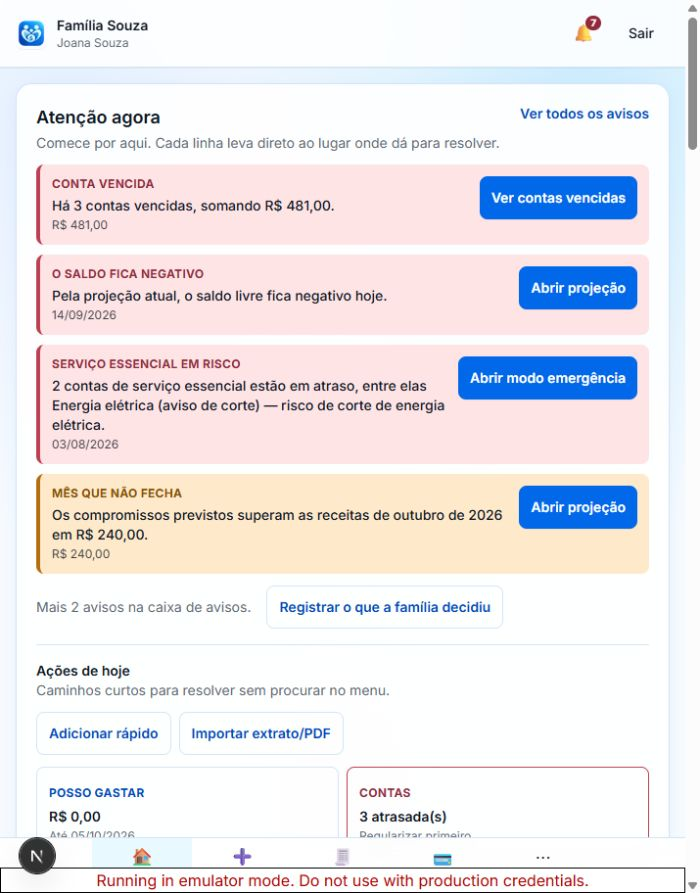
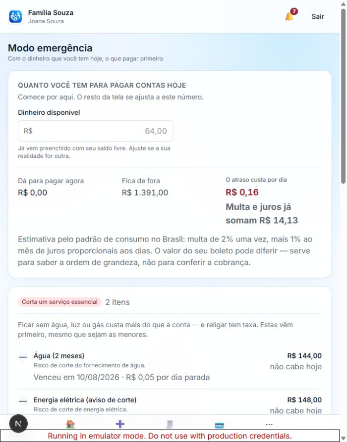
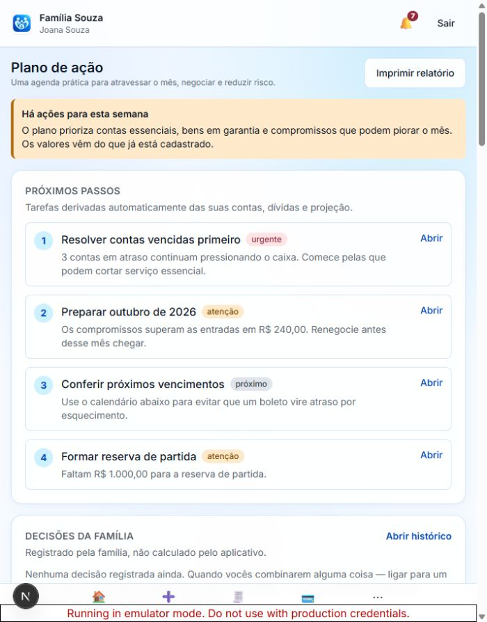
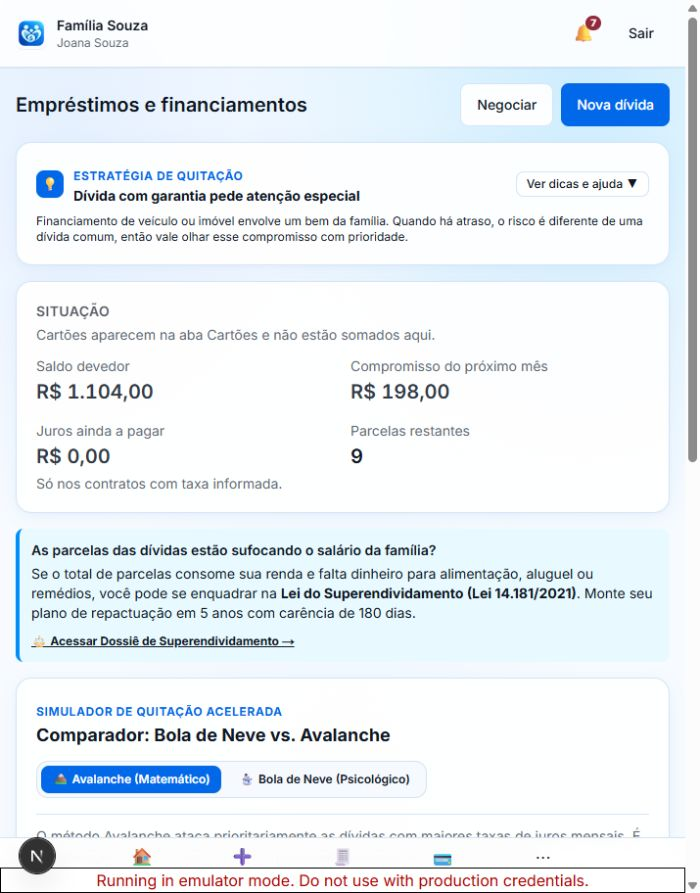
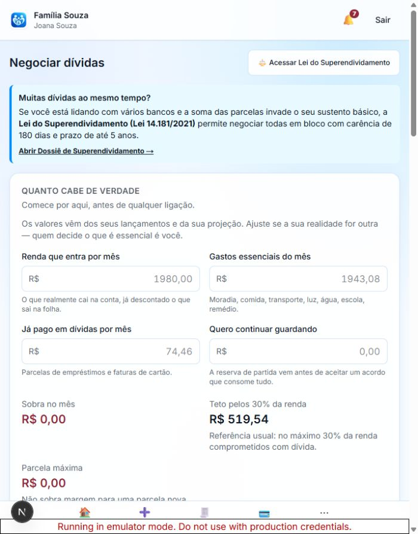
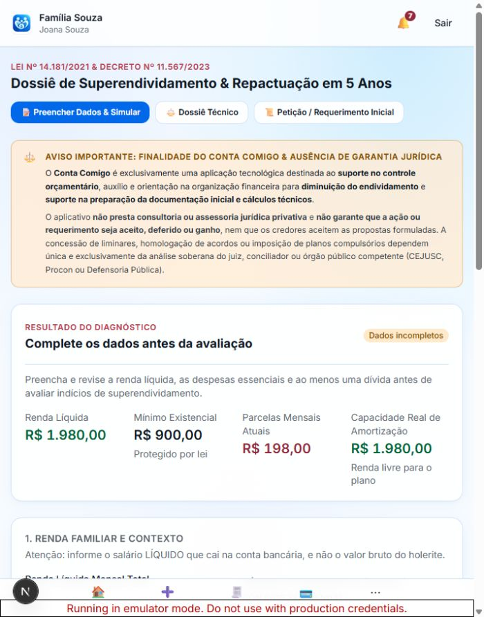

# Auditoria visual — Conta Comigo

Data: 14/09/2026  
Escopo: jornada de uma família em situação crítica, em layout compacto/mobile: painel, emergência, plano, dívidas, negociação e superendividamento.

## Veredito geral

O aplicativo é visualmente consistente, legível e usa cores de estado de forma compreensível. Os cartões, espaçamentos e botões têm boa aparência isoladamente. A dificuldade surge na quantidade: painel, plano e negociação exibem muitas decisões e ferramentas na mesma página, criando rolagens longas e competição entre ações.

Para uma pessoa sob estresse financeiro, a experiência seria mais fácil se cada tela mostrasse primeiro uma única ação recomendada e deixasse análises, simuladores e conteúdo educativo recolhidos ou em páginas secundárias.

## Etapas observadas

### 1. Painel — saúde: precisa de simplificação

Pontos fortes: a prioridade crítica aparece primeiro, usa linguagem concreta e oferece ação direta. Valores e estados são fáceis de localizar.

Riscos: quatro alertas, links auxiliares, oito atalhos, meta, cinco abas e vários painéis analíticos formam uma página muito longa. “Atenção agora” e “Ações de hoje” competem pela função de dizer o próximo passo. IRPF, veículos e imóveis aparecem durante uma crise sem relação com a urgência atual.

Recomendação: mostrar apenas a primeira ação crítica e até duas seguintes; reduzir “Ações de hoje” a três atalhos contextuais; levar cadastros administrativos para “Mais”; recolher saúde, projeções e educação sob “Ver diagnóstico completo”.

### 2. Modo emergência — saúde: boa, com pequenos ajustes

Pontos fortes: pergunta inicial clara, números grandes, ordem baseada em consequência e separação visual forte entre grupos. É a tela mais alinhada à proposta do produto.

Riscos: “Dinheiro disponível: R$ 64” seguido de “Dá para pagar agora: R$ 0” pode parecer erro; o motivo — nenhum item cabe integralmente — não está visível no primeiro quadro. A explicação de juros é longa e ocupa espaço antes da lista urgente.

Recomendação: escrever “Nenhuma conta cabe inteira nos R$ 64 disponíveis” e oferecer “usar como entrada” somente quando houver uma ação segura; recolher a metodologia de juros em “Como calculamos”.

### 3. Plano de ação — saúde: útil, mas extenso

Pontos fortes: os quatro próximos passos são numerados, acionáveis e ordenados. A tela começa bem e transmite direção.

Riscos: depois dos próximos passos, a mesma página reúne decisões, calendário, renda variável, priorização, metas, negociação e relatório. Isso transforma “plano” em um painel paralelo e aumenta a chance de a pessoa abandonar a tarefa.

Recomendação: manter nesta página “Agora”, “Esta semana” e “Depois”; mover simuladores e relatório para páginas próprias; recolher calendário e metas; após concluir uma ação, promover automaticamente a próxima.

### 4. Dívidas — saúde: razoável

Pontos fortes: saldo, parcela e prazo são escaneáveis; ações de negociar e cadastrar estão visíveis; o comparador explica as duas estratégias.

Riscos: o destaque “Dívida com garantia pede atenção especial” aparece para um cenário cujo contrato visível informa não haver bem em garantia. Mesmo sendo uma orientação geral, a proximidade pode levar a interpretação errada. O chamado jurídico separa o resumo do simulador e recebe peso semelhante à ação principal.

Recomendação: tornar a estratégia específica para a dívida selecionada; mostrar o chamado jurídico somente quando os critérios mínimos estiverem preenchidos; separar “Resumo” e “Simular quitação” em abas ou seções recolhíveis.

### 5. Negociação — saúde: excessivamente carregada

Pontos fortes: “Quanto cabe de verdade” é uma excelente entrada; campos têm explicações e os números centrais ficam destacados.

Riscos: a página agrega capacidade de pagamento, avaliação de proposta, cálculo de prazo, feirão, portabilidade e cinco roteiros. São tarefas diferentes, com muitos campos e textos. O acesso ao superendividamento aparece duas vezes antes da primeira ferramenta. Em largura compacta, campos em duas colunas ficam apertados.

Recomendação: criar um seletor inicial — “Preparar ligação”, “Avaliar proposta”, “Comparar portabilidade” ou “Feirão” — e mostrar apenas o fluxo escolhido; manter campos em uma coluna no celular; deixar um único encaminhamento jurídico contextual.

### 6. Superendividamento — saúde: precisa de correção prioritária

Pontos fortes: há aviso de limites, estado “dados incompletos” e ações jurídicas desabilitadas. A hierarquia tipográfica separa diagnóstico e formulário.

Riscos: o aviso jurídico domina a primeira tela e empurra a tarefa para baixo; título e rótulos são longos e em caixa alta; três botões grandes disputam a mesma linha. Mais importante: a seção de proposta continua calculando valores e total em 60 meses apesar de o diagnóstico declarar dados incompletos. Isso pode parecer uma proposta válida.

Recomendação prioritária: ocultar toda a proposta e sua tabela enquanto faltarem dados essenciais, substituindo por um checklist de preenchimento. Resumir o aviso em duas frases com “Ler limites completos”; usar etapas claras — Dados, Revisão, Proposta, Documentos — e liberar cada uma progressivamente.

## Prioridades recomendadas

1. Bloquear visualmente e logicamente a proposta jurídica até os dados estarem completos.
2. Dividir Negociação em fluxos escolhidos pelo usuário, mostrando uma ferramenta por vez.
3. Reduzir o painel a uma ação principal e duas próximas ações contextuais.
4. Transformar o Plano de Ação em sequência curta, com seções secundárias recolhidas.
5. Explicar por que R$ 64 disponíveis ainda resultam em R$ 0 pagáveis no modo emergência.
6. Tornar as mensagens de estratégia de dívida específicas ao contrato mostrado.

## Acessibilidade observável

Há contraste consistente, áreas clicáveis generosas, headings reconhecíveis e navegação fixa. Os testes automatizados e de teclado executados anteriormente passaram, mas capturas não confirmam experiência completa com leitor de tela, zoom de 200%, anúncios de atualização dinâmica ou ordem de foco em todos os formulários.

## Limites

- As capturas foram feitas no ambiente local com dados fictícios da Família Souza.
- A auditoria visual usou o layout compacto ativado pelo navegador interno; não substitui testes em aparelhos físicos e múltiplas resoluções.
- Foram avaliados os estados iniciais das páginas, não todas as combinações de formulários, erros e confirmações.
- A análise avalia clareza e usabilidade, não validade jurídica dos documentos ou cálculos legais.

## Correções implementadas

Após esta auditoria, foram aplicadas as seguintes mudanças:

- a proposta de repactuação e sua tabela ficam ocultas enquanto os dados essenciais estiverem incompletos; em seu lugar aparece um checklist;
- o aviso jurídico passou a iniciar recolhido, com um resumo direto;
- a página de negociação ganhou um seletor de tarefas e mostra apenas uma ferramenta por vez;
- o painel teve os atalhos administrativos removidos do bloco “Ações de hoje”, com encaminhamento para “Mais”;
- o plano passou a mostrar primeiro os próximos passos e a recolher calendário, simuladores, metas e relatório em “Ver detalhes do plano”;
- o modo emergência explica quando há dinheiro disponível, mas nenhuma conta cabe integralmente, e recolhe a metodologia de juros;
- a orientação da página de dívidas agora distingue contratos com e sem bem em garantia.

Validação: typecheck e lint aprovados; 14 testes de domínio aprovados; 12 testes E2E direcionados aprovados em desktop e mobile, incluindo os novos fluxos e verificações de acessibilidade automatizada.
